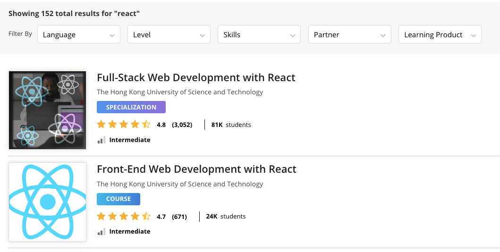
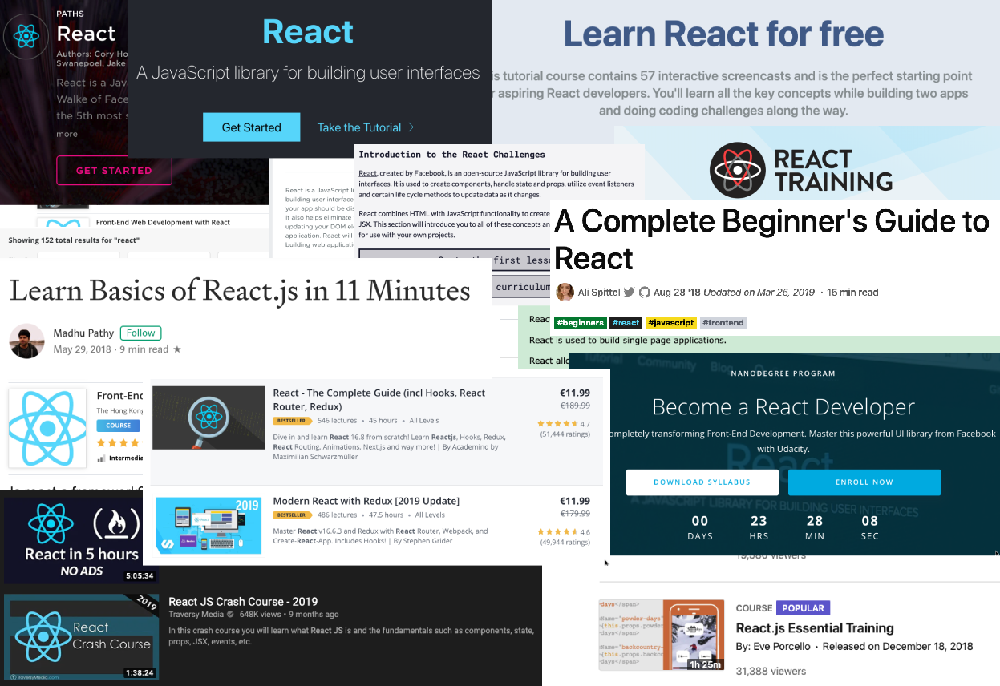

#### Let's make a Search engine 

#### for Learning resources

<small>

Dominik Teiml

@dteiml

[dteiml.github.io/presentations](dteiml.github.io/presentations) --> Amos @ MTSR

</small>

---

<!-- How many people have ever learned something online? -->

Say you want to learn something

like React.js

Where do you go to find learning material?

--

1. Coursera

<!-- Your options are -->

--

---

<!-- .slide: style="text-align: left;" -->
## THE END