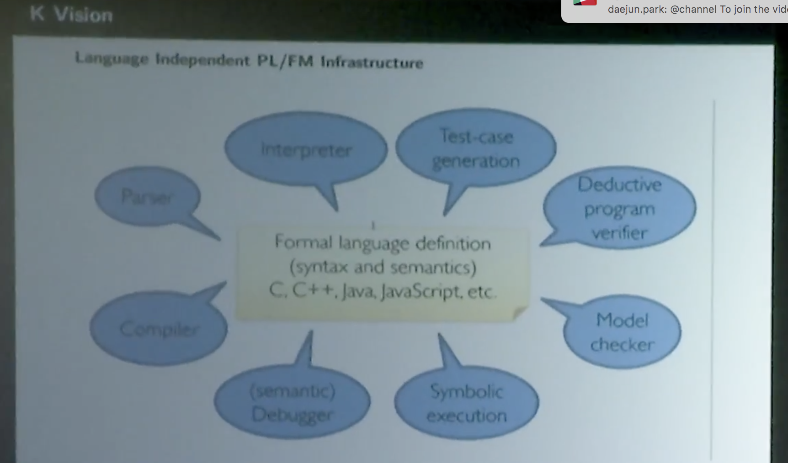

## Ethereum Virtual Machine:
## First Steps

Dominik Teiml

---

### Talk outline

- Talk outline
- Introduction to K
- Introduction to EVM
- EVM Opcodes
- Specifying K-EVM
  - Data strutures
  - Configuration & Opcodes

<br />

<small>Disclaimer: Everything here is my understanding of K and may not be true.</small>

---

### Introduction to K

--

- Currently, most languages are specified in one of two ways: 
    - Reference manual - e.g. C Reference manual (1100 p.)
        - Problems: Not rigorous
        - Not executable
    - Reference implementation
        - Impossible to reason about formally
        - ...

--

<section>
<iframe class="stretch" src="https://www.youtube.com/embed/eSaIKHQOo4c" frameborder="0" allow="autoplay; encrypted-media" allowfullscreen></iframe>
</section>

--

K is a programming language to define (all) other programming lanaguages

<br />

| concept  | keyword  |   |
|---|---|---|
| syntax  | `syntax`  |
| state  | `configuration`  |
| semantics | `rule` |

--



--

[Demo](https://raw.githubusercontent.com/kframework/k/master/k-distribution/tutorial/1_k/2_imp/lesson_4/imp.k)

--

#### WASM Configuration
<small>
```a
    <k> $PGM:Instrs </k>
    <stack> .Stack </stack>
    <curFrame>
    <addrs>   .Map </addrs>
    <locals>  .Map </locals>
    <globals> .Map </globals>
    </curFrame>
    <store>
    <funcs>
            <funcDef multiplicity="*" type="Map">
            <fname>  0       </fname>
            <fcode>  .Instrs </fcode>
            <ftype>  .Type   </ftype>
            <flocal> .Type   </flocal>
            <faddrs> .Map    </faddrs>
            </funcDef>
    </funcs>
    </store>
```
</small>

---

### Introduction to EVM

--

#### What is a machine?

A machine is a *model of computation*. It has a state and an instruction set (e.g. x86).

--

#### What is a virtual machine

A virtual machine is *an emulation of a machine*.

It is an *execution environment*.

- E.g. Java Virtual Machine

--

#### What is the Ethereum Virtual Machine

The Ethereum Virtual Machine is *the execution environment for Ethereum transactions*. 

--

#### What is Ethereum?

> Ethereum, taken as a whole, can be viewed as a
transaction-based state machine: we begin with a genesis
state and incrementally execute transactions to morph
it into some final state. 

Yellow Paper (Gavin Wood)

--

<small>
More specifically:
- Ethereum has "external" accounts, but unlike Bitcoin, these cannot hold any code
- Ethereum also has "contract" accounts (*smart contracts*) that hold code
- An Ethereum tx has:
    - *To* (address)
    - *Value* (integer)
    - *Data* (bytecode)
- If *To* contains code (i.e. is a contract), it will be executed

(Abstracting away pr & pub keys, address/account generation, UTXO vs balance model, gas - for now)
</small>

--

I said if the *To* field contains code, it will be executed.

Let's look at how

--

- A smart contract is a string of bytes
    - A byte is $8$ bits ($2^8 = 256$ options)
        - Can be represented using two hexadecimal numbers ($1$ hexadecimal number = $16$ options, $2$ hexadecimal numbers = $16^2=256$ options)
- Each byte corresponds to an opcode

---

### EVM Opcodes

--

[Demo](https://github.com/trailofbits/evm-opcodes)

--

<small>
- Arithmetic operations (`modulo 256`)
- Cryptographic fns (`sha3`)
- Tx/block-specific info (Caller, Blockhash)

- Program counter

- Stack 
    - PUSH
    - POP
- Memory 
- Storage 

- Call

</small>

--

These opcodes tell us everything we need to know about EVM!

- 32-byte words
- data cells
- Calls
- gas

---

### Specifying EVM

--

We start by defining data structures: [data.md](https://github.com/kframework/evm-semantics/blob/master/data.md)

--

Next we specify the configuration and opcode semantics: [evm.md](https://github.com/kframework/evm-semantics/blob/master/evm.md)

---

### Conclusion
#### What is it for?

- K is a cool & fun
- It's the best way to learn about EVM 
- It enables formal verification

---

<!-- .slide: style="text-align: left;" -->
## THE END