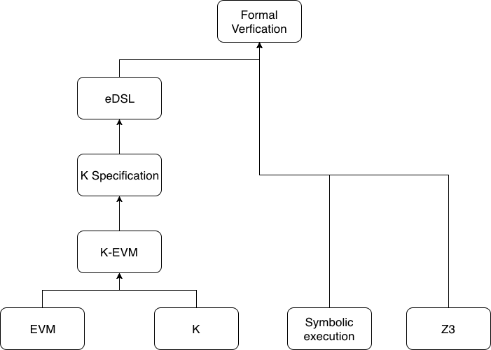

## Formal Verification:
## (Part 1)

<small>
www.github.com/dteiml/presentations --> formal-verification-part-1
</small>

Dominik Teiml

Gnosis

---




--


--

### Goals of talk

- learn about EVM
- see K
- see how EVM can be defined in K

---

## EVM

--

- Ethereum Virtual Machine
- execution environment for Ethereum tx
- There are multiple versions of EVM
- Rule of thumb: all EVM's semantics can be constructed from the definitions of the opcodes
- Gives rise to data structures such as `word` and `address` and stores such as `stack`, `memory`, `storage`, ...

--

### Frontier (July 30, 2015)
- Programs are abstracted as numbers, low-level representation is a byte buffer
- Each byte can be represented by two hexadecimal numbers (0-f)

--

Most popular opcodes:

| GNO   | Count |
| ----- | ----- |
| PUSH1 | 178   |
| POP   | 90    |
| SWAP1 | 84    |
| DUP2  | 79    |
| ADD   | 70    |

--

Most popular opcodes:

| Gnosis Safe | Count |
| ----------- | ----- |
| PUSH1       | 1380  |
| POP         | 845   |
| DUP1        | 700   |
| ADD         | 641   |
| SWAP1       | 639   |

--

65 (130) opcodes

```
- general
    - control-flow 
        - STOP 12
        - JUMP 131
        - JUMPI 178
        - JUMPDEST 306
        - PC 0
        - INVALID 8
    - arithmetic & bit functions & predicates
        - ADD 641
        - ISZERO 252
        - EQ 92
        - OR 26
        - GT 9, ...
    - stack
        - PUSH1-32
        - POP
        - DUP1-16
        - SWAP1-16
    - memory
        - MLOAD 289
        - MSTORE 436
        - MSTORE8 0
        - MSIZE 0
    - storage
        - SSTORE 25
        - SLOAD 61
        - SELFDESTRUCT 0
- blockchain specific
    - cryptography
        - SHA3 58
    - current tx
        - ADDRESS 10
        - BALANCE 0
        - ORIGIN 1
        - CALLER 14
        - GASPRICE 0
    - blocks info
        - BLOCKHASH 0
        - COINBASE 0
        - TIMESTAMP 0
        - NUMBER 0
        - DIFFICULTY 0
        - GASLIMIT 0
    - network read/write
        - CREATE 1
        - CALL 5
        - CALLCODE 0
        - EXTCODESIZE 1
        - EXTCODECOPY 0
    - other stores
        - CALLVALUE 32
        - CALLDATALOAD 77
        - CALLDATACOPY 12
        - CALLDATASIZE 21
        - CODESIZE 2
        - CODECOPY 2
        - GAS 12
        - LOG0-4
        - RETURN 22
```

--

Note - Other ways to categorize

- whether they change state (LOG, SSTORE, CALL, CREATE, SELFDESTRUCT)
- how much stack they eat
    - NullStackOp, ..., SenaryStackOp
- by gas
    - each opcode is assigned a gas constant/fn
    - classes:
        - GZero
        - GVeryLow, ...

--

### Precompiled contracts

- 0x1: ECREC
- 0x2: SHA256 - SHA2-256
- 0x3: RIP160 - RIPEMD160
- 0x4: ID - identity fn

--

Notation: EIP (Ethereum Improvement Proposal) is a proposed change to the Ethereum protocol. EIP's get merged in a "hard fork".

Note that all upgrades of the EVM require a hard fork/EIP, but not all EIP's upgrade EVM. EIP's can also be:
- change in balances (EIP 779 - DAO)
- client changes (EIP 158 & 161 to eliminate DoS)
- block reward changes (Byz & Const)
- difficulty changes (introducing Ice Age in Sept 2015, delaying it in Byz & Const)

--

#### Homestead (Mar 2016)
- increased contract creation tx cost from 21k to 53k
- new opcode :P DELEGATECALL 1
    - bugfix to CALLCODE

--

#### Tangerine Whistle (end 2016)
- increased I/O ops gas costs:
    - BALANCE 20 --> 400
    - SLOAD 50 --> 200
    - CALL 40 --> 700
    - SELFDESTRUCT 0 --> 5000
    - EXTCODESIZE & EXTCODECOPY 20 --> 700

<br />

#### Spurious Dragon (end 2016)

- Nothing significant

--

#### Byzantium (Oct 2017)

- new opcodes :P
    - REVERT 77
    - STATICCALL 0
    - RETURNDATASIZE 7
    - RETURNDATACOPY 3
- new precompiled contracts
    - 0x5: MODEXP - for RSA signature validation
    - 0x6: ECADD - for ZK-Snarks
    - Ox7: ECMUL - for ZK-Snarks
    - 0x8: ECPAIRING - for ZK-Snarks

--

#### Constantinople (early 2019)

- new opcodes
    - SHL, SHR, SAR 0
    - CREATE2 0
    - EXTCODEHASH 0
- Changes SSTORE metering

---

### K

--

K is a programming language to define *syntax* and *semantics* of programming languages.

- Syntax
    <!-- - A grammar for a programming/natural language -->
    - *Look* of a language
    <!-- - E.g. for English, any sentence of the form `Article Subject Verb Article Adject Object` is syntactically correct. -->
- Semantics
    - *Meaning* of a language

--

Declarations:
- `Syntax`: syntactic rules
    - BNF notation
    - E.g.    
```
        syntax AExp ::= AExp "*" AExp    [strict, left]
                      > AExp "+" AExp
```

- `Configuration`: define language stores
    - XML (HTML) notation with `cells`
```
    <IMP>
        <k> $PGM:Pgm </k>
        <state> .Map </state>
    </IMP>
```

--


- `Rule`: semantic rules
    - rewrite rules
    - e.g. `rule I1 * I2 => I1 *Int I2`

--

```
module CALC
  syntax AExp  ::= Int
                 | "-" Int
                 | AExp "/" AExp              [left, strict]
                 | AExp "*" AExp              [left, strict]
                 > AExp "+" AExp              [left, strict]
                 | AExp "--" AExp             [left, strict]
                 | "(" AExp ")"               [bracket]


  syntax KResult ::= Int
  rule I1 / I2 => I1 /Int I2  requires I2 =/=Int 0
  rule I1 * I2 => I1 *Int I2
  rule I1 + I2 => I1 +Int I2
  rule I1 -- I2 => I1 -Int I2
  rule - I1 => 0 -Int I1
endmodule
```

---

K-EVM

--

<!-- Let's have a look again at EVM opcodes, this time with the  -->

```
- general
    - control-flow 
        - STOP 12
        - JUMP 131
        - JUMPI 178
        - JUMPDEST 306
        - PC 0
        - INVALID 8
    - arithmetic & bit functions & predicates
        - ADD 641
        - ISZERO 252
        - EQ 92
        - OR 26
        - GT 9, ...
    - stack
        - PUSH1-32
        - POP
        - DUP1-16
        - SWAP1-16
    - memory
        - MLOAD 289
        - MSTORE 436
        - MSTORE8 0
        - MSIZE 0
    - storage
        - SSTORE 25
        - SLOAD 61
        - SELFDESTRUCT 0
- blockchain specific
    - cryptography
        - SHA3 58
    - current tx
        - ADDRESS 10
        - BALANCE 0
        - ORIGIN 1
        - CALLER 14
        - GASPRICE 0
    - blocks info
        - BLOCKHASH 0
        - COINBASE 0
        - TIMESTAMP 0
        - NUMBER 0
        - DIFFICULTY 0
        - GASLIMIT 0
    - network read/write
        - CREATE 1
        - CALL 5
        - CALLCODE 0
        - DELEGATECALL 1
        - STATICCALL 0
        - EXTCODESIZE 1
        - EXTCODECOPY 0
    - other stores
        - CALLVALUE 32
        - CALLDATALOAD 77
        - CALLDATACOPY 12
        - CALLDATASIZE 21
        - CODESIZE 2
        - CODECOPY 2
        - GAS 12
        - LOG0-4
        - RETURN 22
        - REVERT 77
        - RETURNDATASIZE 7
        - RETURNDATACOPY 3
```

--

This naturally lends itself to a configuration:

```XML
<EVM>
    <k> $PGM:EthereumSimulation </k>
    <statuscode> .StatusCode </statuscode>
    <callState>
        <program> .Map </program>
        <pc> 0 </pc>
        <wordStack> .WordStack </wordStack>
        <localMem> .Map </localMem>
        <id> 0 </id>
        <caller> 0 </caller>
        <callValue> 0 </callValue>
        <callData> .WordStack </callData>
        <gas> 0 </gas>
        <previousGas> 0 </previousGas>
    </callState>
    <accounts>
        <account multiplicity="*">
            <acctID> 0 </acctID>
            <balance> 0 </balance>
            <code> .WordStack </code>
            <storage> .Map </storage>
            <nonce> 0 </nonce>
        </account>
    </accounts>
    <gasPrice> 0 </gasPrice>
    <blockHash> .List </blockHash>
    <coinbase> 0 </coinbase>
    <timestamp> 0 </timestamp>
    <number> 0 </number>
    <difficulty> 0 </difficulty>
    <output> .WordStack </output>
    <log> .List </log>
    <refund> 0 </refund>
    <selfDestruct> .Set </selfDestruct>
</EVM>
```

--

```
configuration
      <k> $PGM:EthereumSimulation </k>
      <schedule> $SCHEDULE:Schedule </schedule>
      <ethereum>
        <evm>

          // Mutable during a single transaction
          
          <output>          .WordStack  </output>
          <statusCode>      .StatusCode </statusCode>

          <program>      .Map       </program>            
          <programBytes> .WordStack </programBytes>
          <id>        0          </id>               
          <caller>    0          </caller>           
          <callData>  .WordStack </callData>                
          <callValue> 0          </callValue>   
          <wordStack>   .WordStack </wordStack>
          <localMem>    .Map       </localMem>         
          <pc>          0          </pc>        
          <gas>         0          </gas>      
          <memoryUsed>  0          </memoryUsed>          
          <previousGas> 0          </previousGas>
          <selfDestruct> .Set  </selfDestruct>
          <log>          .List </log>
          <refund>       0     </refund>

          // Immutable during a single transaction

          <gasPrice> 0 </gasPrice>
          <origin>   0 </origin>

          // Block info
          <previousHash>     0          </previousHash>     // I_Hp
          <ommersHash>       0          </ommersHash>       // I_Ho
          <coinbase>         0          </coinbase>         // I_Hc
          <stateRoot>        0          </stateRoot>        // I_Hr
          <transactionsRoot> 0          </transactionsRoot> // I_Ht
          <receiptsRoot>     0          </receiptsRoot>     // I_He
          <logsBloom>        .WordStack </logsBloom>        // I_Hb
          <difficulty>       0          </difficulty>       // I_Hd
          <number>           0          </number>           // I_Hi
          <gasLimit>         0          </gasLimit>         // I_Hl
          <gasUsed>          0          </gasUsed>          // I_Hg
          <timestamp>        0          </timestamp>        // I_Hs
          <extraData>        .WordStack </extraData>        // I_Hx
          <mixHash>          0          </mixHash>          // I_Hm
          <blockNonce>       0          </blockNonce>       // I_Hn

          <ommerBlockHeaders> [ .JSONList ] </ommerBlockHeaders>
          <blockhash>         .List         </blockhash>

        </evm>

        <network>

          <activeAccounts> .Set </activeAccounts>
          <accounts>
            <account multiplicity="*" type="Map">
              <acctID>  0                      </acctID>
              <balance> 0                      </balance>
              <code>    .WordStack:AccountCode </code>
              <storage> .Map                   </storage>
              <nonce>   0                      </nonce>
            </account>
          </accounts>

          <txOrder>   .List </txOrder>
          <txPending> .List </txPending>

          <messages>
            <message multiplicity="*" type="Map">
              <msgID>      0          </msgID>
              <txNonce>    0          </txNonce>            // T_n
              <txGasPrice> 0          </txGasPrice>         // T_p
              <txGasLimit> 0          </txGasLimit>         // T_g
              <to>         .Account   </to>                 // T_t
              <value>      0          </value>              // T_v
              <sigV>       0          </sigV>               // T_w
              <sigR>       .WordStack </sigR>               // T_r
              <sigS>       .WordStack </sigS>               // T_s
              <data>       .WordStack </data>               // T_i/T_e
            </message>
          </messages>

        </network>

      </ethereum>
```

--

(Skipping syntax to talk directly about semantics)

Most of the time, we won't be altering configuration directly from the opcodes. Instead we'll define helper fn's that will begin with #.

--

Let's start at the end: when we get `#halt`, we want to consume all further opcodes:

```
    rule <k> #halt ~> (_:OpCode => .) ... </k>
```

Next we'll need something to be able to set status codes:

```
    rule <k> #end SC => #halt ... </k> <statusCode> _ => SC </statusCode>
```

Q: Assuming a status code of `EVMC_SUCCESS`, what should set it?

--

Hint: 

Either program is fully executed, 

or it halts at an opcode. Which opcodes should result in a successful halt?

--

Answer:

- PC not_in keys(PGM)
- STOP
- RETURN
- SELFDESTRUCT

--

Let's flesh out the actual execution of opcodes.

We're going to start with just one item in the `<k>` cell: `#execute`

```
    rule <k> ( . => #next ) ~> #execute ... </k>
    rule <k> #halt ~> (#execute => .) ... </k>

```

--

<small>

|       |               |                      |             |     |
| ----- | ------------- | -------------------- | ----------- | --- |
| #next | #exceptional? | #invalid?            |             |     |
|       | #exec         | #stackNeeded?        |             |     |
|       | #pc           | #static?             |             |     |
|       |               | #exec [ OP W0 W1 W2] | #gas        |     |
|       |               |                      | OP W0 W1 W2 |     |

</small>

--

CALL:

```
rule <k> CALL GCAP ACCTTO VALUE ARGSTART ARGWIDTH RETSTART RETWIDTH
          => #checkCall ACCTFROM VALUE
          ~> #call ACCTFROM ACCTTO ACCTTO Ccallgas(SCHED, #accountNonexistent(ACCTTO), GCAP, GAVAIL, VALUE) VALUE VALUE #range(LM, ARGSTART, ARGWIDTH) false
          ~> #return RETSTART RETWIDTH
         ...
         </k>
```

--

|      |                           |               |                |
| ---- | ------------------------- | ------------- | -------------- |
| CALL | #checkCall (check BAL)    |               |                |
|      | #call (check precompiled) | #callWithCode | #pushCallStack |
|      | #return                   | #return       | #pushWordState |
|      |                           |               | #transferFunds |
|      |                           |               | #mkCall        |
|      |                           |               | #return        |

--

<small>

|      |            |               |                |          |         |                 |
| ---- | ---------- | ------------- | -------------- | -------- | ------- | --------------- |
| CALL | #checkCall |               |                |          |         |                 |
|      | #call      | #callWithCode | #pushCallStack |          |         |                 |
|      | #return    | #return       | #pushWordState |          |         |                 |
|      |            |               | #transferFunds |          |         |                 |
|      |            |               | #mkCall        | #initVM  |         |                 |
|      |            |               | #return        | #execute | #halt   | #popCallStack   |
|      |            |               |                | #return  | #return | #dropWorldState |
|      |            |               |                |          |         | 1               |
|      |            |               |                |          |         | #push           |
|      |            |               |                |          |         | #refund         |
|      |            |               |                |          |         | #setLocalMem    |

</small>

---

<!-- .slide: style="text-align: left;" -->
## THE END